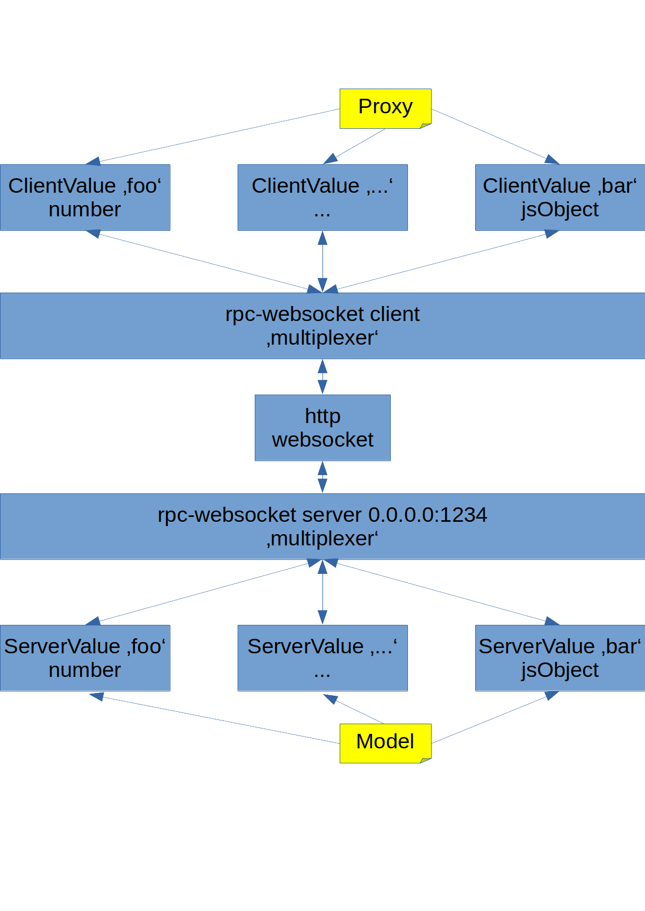

# ws-value

Distribute values via websocket

## Example in TS

### MyInterface
 
#### Common stuff for Client and server 

```typescript
// complex object (may have sub-objects but we keep it simple)
export interface Status {
  foo: number;
  bar: string;
}
```

### Basic Server

```typescript
import {Status} from 'MyInterface';
import {Server} from 'rpc-websockets';
import {ServerValue} from '@zebrajaeger/ws-value';

// bind server to all interfaces and port 8081
const server = new Server({port: 8081, host: '0.0.0.0'});

// register server value of type 'Status' with name 'status' and set initial value
const status = new ServerValue<Status>(server, 'status');
status.setValue({foo: 666, bar: 'hello'});

// register server value of type 'number' with name 'counter and let it uninitialized
const counter = new ServerValue<number>(server, 'counter');
```

### Basic Client

```typescript
import {Status} from 'MyInterface';
import {Client} from 'rpc-websockets';
import {ClientValue} from '@zebrajaeger/ws-value';

// simple value
let counter: ClientValue<number>;
  
// complex value
let status: ClientValue<Status>;

// create websocket client
const client = new Client('ws://192.168.178.68:8081');
    
// until client is ready we can register out values 
this.client.on('open', () => {
  
  // register value with name 'counter' and type 'number'
  this.counter = new ClientValue<number>(this.client, 'counter');

  // register value with name 'status' and type 'Status'
  this.status = new ClientValue<Status>(this.client, 'status');
});
```


### Change values (interface is equal on client and server side)

#### Change value 

```typescript
function incCounter() {
  const v = counter.getValue() || 0;
  counter.setValue(v + 1);
}

function setStatus(s: Status) {
  status.setValue(s);
} 
```

#### Get notificated on value change

```typescript
// call as soon as status has a valid value. Is called only once
status.onInit(newStatus=>{ 
    console.log('init',  newStatus);
});

// call everytime when status has been changed
status.onChange(newStatus=>{ 
    console.log('change', newStatus);
});
```

#### Change equality behavior using deep-equal instead of equal (===) operator

```typescript
import deepEqual = require('deep-equal');

// using custom function within lambda
const status = new ServerValue<Status>(server, 'counter', (o1, o2) => deepEqual(o1, o2));

// or more simple: deepEqual function as parameter
const status = new ServerValue<Status>(server, 'counter', deepEqual);
```

## Overview 



